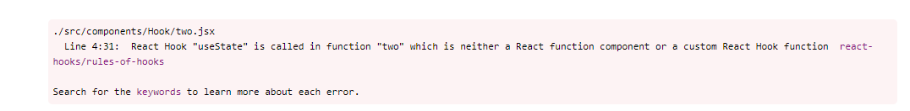
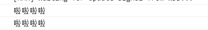
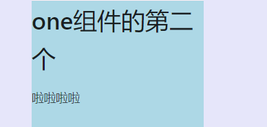
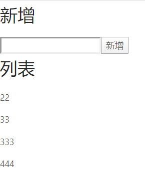
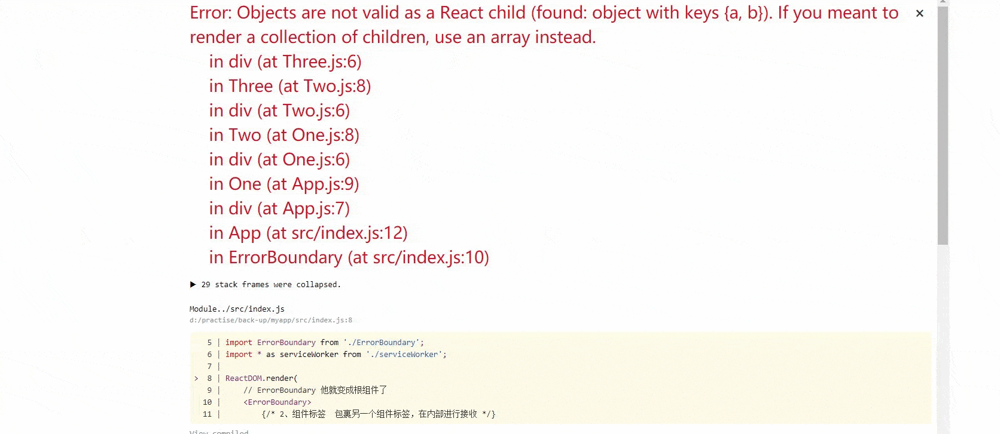

# 一、函数组件
注：在VSC中下载：ES7 React/Redux/GraphQL/React-Native snippets
快捷键是：rfce
`注:函数组件（无状态组件）和类组件的区别：`
| 区别            | 函数组件（无状态组件） | 类组件 |
| --------------- | ---------------------- | ------ |
| 是否有this      | 没有                   | 有     |
| 是否有生命周期  | 没有                   | 有     |
| 是否有状态state | 没有                   | 有     |


## 1、这个是组件 
注：组件名首字母必须大写；否侧会报错，如下

```函数组件：只有props的数据，没有自己的state；     通常我们用到函数式组件 都是展示UI界面的，展示DOM结构的，数据由别人提供，我帮你进行展示，在业务逻辑上，我们也叫UI组件 ```
### 1）这组件
```javascript
import React,{axios} from 'react'

function get(){
    console.log('aaaaaa');

}
function Index() {
    return (
        <div>
            <p onClick={get}>函数组件</p>
        </div>
    )
}
export default Index

```
### 2）在页面中调用

```javascript
import React from 'react';
import './App.css';
import Index from './components/Index';
function App() {
  return (
    <div className="App">
      <Index />
    </div>
  );
}
export default App;
```
## 2、ref的使用
```javascript
import React from 'react'
function Refs() {
    // 这里必须声明 textInput，这样 ref 才可以引用它
    let text = React.createRef();
    //获得输入框的焦点
    function fun() {
        text.current.focus();
    }
    return (
        <div>
            <input
            type="text"
            ref={text} />

            <input
                type="button"
                value="点击我获取输入框的焦点"
                onClick={fun}
            />

        </div>
    )
}
export default Refs;

```
## 3、ref转发

```javascript
import React, { Component } from 'react'

class Class extends Component {
    constructor(props){
        super(props);
        this.state={
            text:'请输入'
        }
    }
    but=()=>{
        console.log(this.point);
        console.log(this.point.value);
    }
    render() {
        return (
            <div>
                <input type='text' defaultValue={this.state.text} ref={(fun)=>{this.point = fun }} />
                <button onClick={this.but}>点击</button>
            </div>
        )
    }
}
export default Class;
```
## 4、通过父页面，向函数组件中传入数据
1）父页面

```javascript
import React from 'react';
import './App.css';
import Function from './components/Function';
function App() {
  return (
    <div>
      {/* 它可以想函数组件中传值 */}
     <Function data='hello word' />
    </div>
  );
}

export default App;
```
2）组件

```javascript
import React from 'react'
function Function(props,context) {
    console.log(props);
    return (
        <div>
            
        </div>
    )
}
export default Function;

```
## 5、Portals的使用
作用：不受外部样式的影响
注：用来构建弹出层
### 1）在src——>components——>Box.js
```javascript
import React, { Component } from "react";
import Modal from './Modal'

import "./style.css";
export default class Box extends Component {
  constructor(props) {
    super(props);
    this.state = {
      show: false
    }
  }
  
  render() {
    const { show } = this.state;
    return (
      <div className="box">
        { show && <Modal onHide={this.btnAction}/> }
        <button onClick={this.btnAction}>显示弹出层</button>
      </div>
    );
  }

  btnAction = ()=>{
    const { show } = this.state;

    this.setState({show: !show});  
  }

  
}

```
### 2)在src——>components——>style.css  给他们设置样式
```css
.box{
  width: 300px;
  height: 400px;
  margin: 50px auto;
  background: yellow;
}
.modal-wrap{
  width: 100%;
  height: 100%;
  position: fixed;
  top: 0;
  left: 0;
  background: rgba(0, 0, 0, 0.7);
  display: flex;
  align-items: center;
  justify-content: center;
}
.modal-wrap p{
  width: 200px;
  height: 50px;
  background: #fff;
  border-radius: 10px;
}
```
### 3）在public——>index.html里添加一个容器，去进行放置

```javascript
<!DOCTYPE html>
<html lang="en">
  <head>
    <meta charset="utf-8" />
    <link rel="icon" href="%PUBLIC_URL%/favicon.ico" />
    <meta name="viewport" content="width=device-width, initial-scale=1" />
    <meta name="theme-color" content="#000000" />
    <meta
      name="description"
      content="Web site created using create-react-app"
    />
    <link rel="apple-touch-icon" href="%PUBLIC_URL%/logo192.png" />
    <link rel="manifest" href="%PUBLIC_URL%/manifest.json" />
    <title>React App</title>
  </head>
  <body>
    <noscript>You need to enable JavaScript to run this app.</noscript>
     <script>
     </script>
    <div id="root"></div>
    <div id="modal"></div>
  </body>
</html>

```
### 4）构建一个组件出来
```javascript
import React, { Component } from 'react'
import ReactDOM from "react-dom";

export default class Modal extends Component {
  constructor(props) {
    super(props);
    this.modal = document.querySelector("#modal");
    // 构建一个元素
    this.parent = document.createElement('div');
    this.parent.className = 'modal-wrap';
    this.parent.addEventListener('click', props.onHide);
  }

  render() {
    // 创建弹出层
    return ReactDOM.createPortal(
      <p>hello</p>,
      this.parent
    );
  }

  componentDidMount(){
    // 添加弹出层
    this.modal.appendChild(this.parent);
  }
 
  componentWillUnmount(){
    //移除弹出层
    this.modal.removeChild(this.parent);
  }
}

```

## 6、Context提供了一个无需为每层组件手动添加props，就能在```组件间```进行数据传递的方法
注：实现组件间数据共享；作用：管理全局共享数据的，而且是不经常变化的数据。
共享数据多用redux。
### 1)使用
注：包裹谁，谁就能共享数据它的数据
#### ①首先创建  src——>context——>DataContext.js
```javascript
// 先引入进来
import {createContext} from 'react';
// 构建一个Context
const DataContext = createContext();//可以给这个括号里，设置一个默认值，当取不到的时候，就会取这个默认值

// 暴露输出(他可以作为一个组件树的上下文，作为一个数据的共享)  
export default DataContext;//那快要用的话，就要引入它
```
#### ②在父页面或者父组件中，包裹子组件
```javascript
import React, { Component } from 'react'
import './style.css';
import Oone from './Oone';
import Otwo from './Otwo';
// 引入（数据的共享，我选择one这个组件树）
import DataContext from '../context/DataContext';

export default class One extends Component {
    render() {
        return (
            /* 使用DataContext.Provider将组件树包裹起来，
            并且把需要的数据 设置好，然后在需要的地方调用数据*/
            // 包裹谁，谁就能共享数据
            <DataContext.Provider value='啦啦啦啦'>
                <div className="one">
                    <h1>one组件</h1>
                    {/* 在下面这个组件中  就可以使用这个数据（啦啦啦啦） */}
                    <Oone />
                </div>
            </DataContext.Provider>
        )
    }
}

```
```注：当他在页面中包裹了组件，组件在包裹一个子组件，那么在这个子组件中，也可以取到数据，取值方法不变，如下：```

#### ③在组件中使用数据
a、第一种使用方法
```javascript
import React, { Component } from 'react'
import './style.css';
// 1、在这里使用数据，先引用进来
import DataContext from '../context/DataContext';
export default class Oone extends Component {
    //3、zai这里获得属性（props），属性值（context），自己会去寻找，就能获取数据了
    constructor(props,context){
        super();//记号这几面是不写的
        // 打印一下，获得的数据
        console.log(context);
    }
    render() {
        // 在别的函数里使用
        console.log(this.context);
        return (
            <div className="o_one">
                <h1>one组件的第一个</h1> 
            </div>
        )
    }
}
// 2、设置类型（给class类型的组件）
Oone.contextType=DataContext;
```


b、第二种使用方法
注：可以不用this，那么就可以写成函数式组件
```函数式组件```
```javascript
import React, { Component } from 'react'
import './style.css';
// 1、引入
import DataContext from '../context/DataContext';

const Otwo=()=>{
    return (
        <div className="o_two">
            <h1>one组件的第二个</h1>
            {/* 2、使用,包裹起来 你需要用数据的结构 */}
            <DataContext.Consumer>
                {/* 在这个里面，写一个js表达式 */}
                {
                    // 这个里面是一个箭头函数
                    (value)=>{
                        return (
                            <div>{value}</div>
                        )
                    }
                }
            </DataContext.Consumer>
        </div>
    )
}
export default Otwo;
```
```类组件```
```javascript
import React, { Component } from 'react'
import './style.css';
// 1、引入
import DataContext from '../context/DataContext';
export default class Otwo extends Component {
    render() {
        return (
            <div className="o_two">
                <h1>one组件的第二个</h1>
                {/* 2、使用,包裹起来 你需要用数据的结构 */}
                <DataContext.Consumer>
                    {/* 在这个里面，写一个js表达式 */}
                    {
                        // 这个里面是一个箭头函数
                        (value)=>{
                            return (
                                <div>{value}</div>
                            )
                        }
                    }
                </DataContext.Consumer>
            </div>
        )
    }
}

```

### 2）实现一个小案例
注：实现数据共享
①先创建一个储存数据的地方 src——>context——>DataContext.js

```javascript
// 1、先引入进来
import {createContext} from 'react';

// 3、构建一个Context,并且输出
export const DataContext = createContext({});//可以给这个括号里，设置一个默认值，当取不到的时候，就会取这个默认值
```
②在父页面引入数据，进行共享
```javascript
import React,{Component} from 'react';
import './App.css';

import Add from './components/Add';
import List from './components/List';
// 4、引入（数据的共享）  DataContext,newdata他俩都在Context这个的内部
import {DataContext} from './context/DataContext';

class App extends Component {
  constructor(props){
    super(props);
    // 把下面这个  当成了一个仓库
    this.state = {
      // 2、暴露输出一个对象(他可以作为一个组件树的上下文，作为一个数据的共享)  
      newdata:{
        list:[],
        // 8、在新增里面肯定不能直接告诉，所以提供一个事件
        onAdd:(value)=>{//在这能接收到那个value值（删除的话，接这给它添加函数）
            console.log('接收到了，新增的值：',value);
            // 10.所以在触发的时候，把数据传入进去(新增的操作)
            // this.list=[...this.list,value];//把这个value改成，json对象，里面有值，有id，方便使用
            // 在这个里面对newdata进行修改
            this.setState({
              // 修改的时候，需要保存全部的，只修改其中的一个
              newdata:{...this.state.newdata,
                // 只修改它，还要把新的对象，放进来
                list:[...this.state.newdata.list,{val:value,id:new Date().getTime()}]
              }
            })
        }
      }
    }
  }
  render() {
    return (
      <div>
        {/* 5、设置基础值 */}
        <DataContext.Provider value={this.state.newdata} > {/* 这个data需要到内部去拿到 */}
          <Add />
          <List />
        </DataContext.Provider>
      </div>
    );
  }
}

export default App;
```
③在组件中进行使用
注：不建议使用它，因为每次改变，都会重新渲染子组件
a、新增组件
```javascript
import React, { Component } from 'react'
// 6、引入
import {DataContext} from '../context/DataContext';

export class Add extends Component {
    constructor(props){
        super(props);
        this.state={
            value:''
        }
    }
    render() {
        // console.log(this.context);
        return (
            <div>
                <h1>新增</h1>
                {/* 在这块设置事件 */}
                <input type='text' value={this.state.value} onChange={this.fun} />
                <button onClick={this.funa}>新增</button>
            </div>
        )
    }
    fun=(e)=>{
        this.setState({
            value:e.target.value
        })
    }
    // 7、得到值，并且发送给列表，但是它不能直接发送，所以要在DataContext.js里进行操作
    funa=()=>{
        // 8、当按钮点击的时候，调用上面的那个事件,并把value值传进去
        this.context.onAdd(this.state.value);  
        // 清空输入框
        this.setState({
            value:''
        })
    }
}
export default Add;
Add.contextType = DataContext;
```

b、列表组件

```javascript
import React, { Component } from 'react'
// 6、引入
import {DataContext} from '../context/DataContext';

export class List extends Component {
    render() {
        // console.log(this.context);
        return (
            <div>
                <h1>列表</h1>
                {/* 11、在这里便利数据 */}
                {
                    this.context.list.map(({val,id})=>(//这里写园括号的意思式 返回值；如果写成花括号的话，就要return
                        <p key={id}>{val}</p>
                    ))
                }
            </div>
        )
    }
}

export default List;
List.contextType = DataContext;
```

# 二、高阶组件的一部分内容
## 1、错误边界
注：组件的层层嵌套
1)专门创建一个组件来处理错误边界
```javascript
// 1、错误边界（这个组件在index.js里进行引入）
import React, { Component } from 'react'

export default class ErrorBoundary extends Component {
    constructor(){
        super();
        this.state={
            // 整个项目有没有错误
            isEorror:false  //用这个变量控制是否出错了
        }
    }
    render() {
        //3、在这块进行接收(children 他就收到了App)
        console.log(this.props.children) 
        // return的时候 给他判断，判断全局它有没有错误
        // 有错误展示<h1>出错了</h1>;没有错误的话，就展示这个App
        return this.state.isEorror?(
            <div>
                <h1>出错了。。。</h1>
                {*刷新浏览器，就是重新再进来一次的意思（反正就是各种提示）*}
                <h2>请刷新浏览器！！！</h2>
            </div>
        ):this.props.children
    }
    // 内部的任何组件发生了错误，都会跑到这个方法中来
    static getDerivedStateFromError(error){
    	//在这我就可以把错误信息传递给后台，后台将错误存入数据库，保存起来
        return {
            //在这它就会去上面的那个state里面的数据，进行合并，然后render里面就会重新渲染
            isEorror:true
        }
    }
}
```
2）在index.js里引入，并且包裹App这个页面（所以上面创建的那个 就是根组件了）
```javascript
import React from 'react';
import ReactDOM from 'react-dom';
import './index.css';
import App from './App';
import ErrorBoundary from './ErrorBoundary';
import * as serviceWorker from './serviceWorker';

ReactDOM.render(
    // ErrorBoundary 他就变成根组件了
    <ErrorBoundary>
        {/* 2、组件标签  包裹另一个组件标签，在内部进行接收 */}
        <App />
    </ErrorBoundary>,
    document.getElementById('root'));
serviceWorker.unregister();
```
```一个异常组件，把真实的根组件进行包裹，那就可以解决这个错误```
3）在App.js里引入组件A，在组件A里引入组件B，在组件B里引入组件C，在组件C里写一个错误的东西(当然也可以在别地方出错)。
```javascript
import React, { Component } from 'react'

export default class Three extends Component {
    render() {
        return (
            <div style={{padding:'150px',background:"#67a"}}>
                <h1>three组件</h1>
                {{a:1,b:2}}
            </div>
        )
    }
}
```
```在外面使用了错误捕获，在内部就别使用了```

## 2、ref转发
注：只想获得组件内部的普通标签。
```在外部设置了ref，获得了内部的标签就叫ref转发```
1）在页面或者组件中，使用组件
```javascript
import React, { Component } from 'react';
import Box from './components/Box';
export default class App extends Component {
    constructor(){
        super();
        this.box=React.createRef();
    }
    render() {
        return (
            <div>
                <h1>App页面</h1>
                {/* ref给组件设置了，但是不想获取这个组件本身，想获取这个组件的内部标签 */}
                <Box ref={this.box} />
                {/* 这里接收到了ref */}
            </div>
        )
    }
    componentDidMount(){
        console.log(this.box)
        // 就可以在这里对他进行改变
        this.box.current.style.background='yellow'
    }
}

```
2）在组件中
①函数式组件
```javascript
import React, { Component } from 'react'

// 做ref的转发，不要用class组件
export default React.forwardRef((props,ref)=>{
    return (
        <div className="box-wrap">
            <div className="box" style={{padding:'100px',background:'red'}}>
                {/* 要获得谁，就在这块进行设置 */}
                <h1 ref={ref}>box</h1>
                <ul>
                    <li>item1</li>
                    <li>item2</li>
                    <li>item3</li>
                    <li>item4</li>
                </ul>
            </div>
        </div>
    )
})
/*上面是函数式组件  只能接收到一个props，把他当成一个参数，传入到forwardRef中
（在外部标签中使用的时候，获得外部的ref）*/
```
②类组件做ref转发（要在类组件中使用，也必须嵌套进去）
```javascript
import React, { Component } from 'react';
import { Divider } from 'antd';

export default React.forwardRef((props,ref)=>{
    class Box extends Component{
        render(){
            return (
                <div>
                    <div className="box-wrap">
                        <div className='box' ref={ref} style={{padding:'100px',background:'red'}}>
                            <h1>box</h1>
                            <ul>
                                <li>一</li>
                                <li>二</li>
                                <li>三</li>
                                <li>四</li>
                            </ul>
                        </div>
                    </div>
                </div>
            )
        }
    }
    return <Box />
})
```
## 3、

# 三、在函数组件中使用HOOK

## 1、[State Hook的使用](https://zh-hans.reactjs.org/docs/hooks-state.html)
注：useState 方法的时候做了什么? 它定义一个 “state 变量”。

### 1）使用hook的值
```javascript
import React,{useState} from 'react'

function Apply() {
    /**
     * 声明一个叫 “count” 的 state 变量(他与this.state 提供的功能完全相同)     state 中的变量会被 React 保留
     * 类似于 this.state = { count: 0 }
     * 声明的名称叫做Xxx ，那么必定有一值叫做 setXxx()   (固定写法)
     */
    const [count, setCount] = useState(4);//如果想在state中储存两个不同的变量，只需调用 useState() 两次即可

    return (
        <div>
            {/* 使用当前的值 */}
            {count}
        </div>
    )
}
export default Apply

```
### 2）改变值

```javascript
import React,{useState} from 'react'
function Apply() {
    // 声明一个叫 “count” 的 state 变量(他与this.state 提供的功能完全相同)     state 中的变量会被 React 保留
    //第一个值是变量名，第二个值可以用来修改变量
    const [count, setCount] = useState(4);//如果想在state中储存两个不同的变量，只需调用 useState() 两次即可

    return (
        <div>
            {/* 调用 改变当前的值 */}
            <button onClick={()=>setCount(count + 1)}>使用Hook改变当前的值</button>
            {count}
        </div>
    )
}
export default Apply;
```
### 3）多条数据

```javascript
import React,{useState} from 'react'

function Apply() {  //Apply是组件名，首字母必须大写
    // 声明一个叫 “count” 的 state 变量(他与this.state 提供的功能完全相同)     state 中的变量会被 React 保留
    //第一个值是变量名，第二个值可以用来修改变量
    const [count, setCount] = useState(4);//如果想在state中储存两个不同的变量，只需调用 useState() 两次即可
  	//在数据请求成功之后，通过setTodos对todos进行修改或者更新
    const [todos, setTodos] = useState([{ text: '学习 Hook' },{text:'Hook'}]);

    //第二种方法 
    let newtext=todos.map((v,i)=>{
        return <p key={i}>{v.text}</p>
    })
    
    return (
        <div>
            {/* 调用 改变当前的值 */}
            <button onClick={()=>setCount(count + 1)}>使用Hook改变当前的值</button>
            {count}

            {/* 便利数据 */}
            {/* 第一种方法 */}
            {
                todos.map((v,i)=>{
                    return <p key={i}>{v.text}</p>
                })
            }
            {/* 第二种方法 */}
            {newtext}
        </div>
    )
}
export default Apply;
```

## 2、[Effect Hook的使用](https://zh-hans.reactjs.org/docs/hooks-effect.html)
注：可以把 useEffect Hook 看做 componentDidMount（组件渲染之后调用），componentDidUpdate（在组件完成更新后立即调用） 和 componentWillUnmount（在组件从 DOM 中移除之前立刻被调用） 这三个函数的组合。
### 1）基本使用
```javascript
import React,{useState,useEffect} from 'react'

function Effect() {
    const [count,setCount]=useState(6);
    // 在这块使用useEffect  类似于componentDidMount 和 componentDidUpdate
    useEffect(()=>{   //可以在 effect 中获取到最新的 count 值,替换掉前一个值
        //document.title是改变页面标题
        document.title = `我是变量 ${count}`;
    })

    // 如果把他写在import同级处，setCount这个方法取不到
    function fun(){
        setCount(count + 1);
     }
    return (
        <div>
            <button onClick={fun}>点</button>
        </div>
    )
}
export default Effect;
```
### 2）创建自定义Hooks
注：可以在多个地方调用
①创建
```javascript
import {useState, useEffect} from 'react';
//注意 hooks 约定必须以 user 开头
const useFetchData = (filmId) => {
    const [loading, setLoading] = useState(false);//只有在第一次加载的时候，才会被false赋值
    const [data, setData] = useState({});
    useEffect(() => {
        setLoading(true);
        fetch("https://mock.mengxuegu.com/mock/60434bccf340b05bceda3906/practise-nuxtjs/test")
            .then((req) => {
                return req.json()
            })
            .then(res => {
                console.log(res);
            },[filmId]);//可以给这加一个方法，当参数变化的时候 才触发
    })
    return [loading, data]
}
export default useFetchData;
```
②使用
```javascript
//svg的引入
// import logo from './logo.svg';
import useFetchData from "./api/FeactData.js";
function App() {
    useFetchData(1);
    return (
        <div className="App">
        
        </div>
    );
}
export default App;
```

`注：`
[社区里面共享的常用业务Hooks](https://github.com/gragland/usehooks)：https://github.com/gragland/usehooks