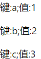
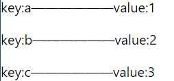
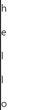

# 一、React.Component 类组件的写法
## 1、创建组件
1）（src——>components——>组件名.js）
快捷键：
```java
import React from 'react';
class Text extends React.Component{
    constructor(){
        super();
    }
    render(){
    	//样式的一种写法
        let obj={
            color:'red'
        }
        return <div style={obj}>
            hello word~
        </div>
    }
}
export default Text;
```
2）在App.js里引入

```java
import React from 'react';
import './App.css';

import Text from './components/Shiyan.js'
function App() {
  return (
    <div className="App">
      <Text></Text>
    </div>
  );
}

export default App;
```
## 2、获取输入框的值

```javascript
import React from 'react';

class Xxxx extends React.Component{
    render() {
        return (
            <div>
                <input type="text" ref={(input)=>{this.text = input}}/>
                <button onClick={
                    ()=>{
                        console.log(this.text.value)
                    }
                }>点</button>
            </div>
        )
    }
}

export default Xxxx;
```

## 3、用数据改变视图
控制div的显示隐藏

```java
import React,{Component} from 'react';
//yong es6构建一个类，来继承下面的组件 
export default class Images extends Component {
    constructor(props){
        super(props);
        this.state={
            stage:0
        }
    }
    render() {
        // 从状态结构过来值
        let {stage} = this.state;
        return (
            <div>            
                {/* 控制，显示隐藏   0的时候显示，不为零的时候，隐藏 */}{/* 外面这个放表达式，里面放样式 */}
                <div style={{
                    display:stage===0?'block':'none',background:'red'
                }}>
                </div>
            </div>
        )
    }
}

```

# 二、使用
## 1、样式的操作

### 1）动态的添加一个类名
```javascript
import React, { Component } from 'react'
export default class one extends Component {
    render() {
        // 根据变量去添加类名
        let isActive = true;
        return (
            <div>
                {/* 这块的意思是，当他为真的时候，添加一个class名 */}
                <p className={`box ${isActive?'zhen':'jiade'}`}>eeeeee</p>
            </div>
        )
    }
}

```
### 2)内联样式

```javascript
import React, { Component } from 'react'
export default class one extends Component {
    render() {
        return (
            <div>
                {/* 因为他是js文件，所以设置样式要加引号，分开用逗号；加两层话括号的意思，第一层是解析，第二层才是样式的书写 */}
                <div style={{width:'100px',height:'100px',background:'red'}}></div>
            </div>
        )
    }
}

```
## 2、条件判断
1）三目运算符
```java
import React, { Component } from 'react'
export default class List extends Component {
    render() {
        // 下面这样写标签，就为一个对象
        const redBox = <div style={{width:'50px',height:'50px',background:'red'}}></div>
        const blueBox = <div style={{width:'50px',height:'50px',background:'blue'}}></div>
        const yellowBox = <div style={{width:'50px',height:'50px',background:'yellow'}}></div>

        // 下面有一个变量
        let value = 'yellow';
        return (
            <div>
                {
                    //这块条件判断的意思是，如果value等于yellow，南无就展示红色的这个盒子
                   value==='red'? redBox:(
                        //这块展示黄色的盒子    
                       value==='blue'?blueBox:yellowBox
                    )
                }
            </div>
        )
    }
}
```
2）&& 与运算符
注：他是前面成立，后面才执行

```javascript
import React, { Component } from 'react'
export default class List extends Component {
    render() {
        let show=true;
        return (
            <div>
                {
                    //当show为真的时候，显示下面这个div
                    show && <div style={{width:'100px',height:'100px',background:'#999'}}></div>
                }
            </div>
        )
    }
}
```
3）|| 或运算符
注：当前面为真的时候 不显示，为假的时候 显示

```javascript
import React, { Component } from 'react'
export default class List extends Component {
    render() {
        let shows=false;
        return (
            <div>
                {
                    shows || <div style={{width:'100px',height:'100px',background:'green'}}></div>
                }
            </div>
        )
    }
}
```
## 3、便利
注：所有的便利都是基于map这个方法，除了自运行那个函数，它返回一个新数组。
### 1）便利对象
①第一种写法
```javascript
import React, { Component } from 'react'
export default class List extends Component {

    render(){
        let obj={
            a:1,
            b:2,
            c:3
        }
        return (
            <div>
               {/* 遍历对象的方法 */}
                {
                    // 这里写一个自运行函数
                    (()=>{
                        let dom=[];
                        for(const key in obj){
                            if(obj.hasOwnProperty(key)){
                                const value=obj[key];
                                // 把上面的插入dom
                                dom.push(<p key={key}>键:{key};值:{value}</p>)
                            }
                        }
                        // 运算结果要 return出来
                        return dom;
                    })()
                }
            </div>
        )
    }
}
```


②第二种写法

```javascript
import React, { Component } from 'react'
export default class List extends Component {

    render(){
        let obj={
            a:1,
            b:2,
            c:3
        }
        return (
            <div>
                {/* Object.entries(这个里面放对象名)  
                他是把对象里面的key和value拿出来，拿出的每一项都是一个数组；拿出来的数组里的第一个是key值，第二个是value值；他们是由一个大数组包裹的
                简单的来说，他就是把对象转成了数组，就可以使用map了
                [
                    [key值,value值],
                    [key值,value值]
                ] */}
                {
                    // 并且这里的item是一个小数组，所以我们要结构他
                    Object.entries(obj).map(([key,value],index)=>{
                        return <p key={key}>key:{key}——————value:{value}</p> //他也可以取成上面的值
                    })
                    // 上面的等价于Object.entries(obj).map(([key,value],index)=><p key={key}>{value}</p>
                }
            </div>
        )
    }
}
```

### 2）便利字符串
```javascript
import React, { Component } from 'react'
export default class List extends Component {

    render(){
        let str = 'hello'
        return (
            <div>
                {
                    str.split('').map((item,index)=>(
                        <p key={index}>{item}</p>
                    ))
                }
            </div>
        )
    }
}
```

### 3）便利数字
```javascript
import React, { Component } from 'react'
export default class List extends Component {
    render(){
        let num = 5;//要从一便利到五
        return (
            <div>
                {
                	//根据值，去构建相等长度的数组，在进行便利
                    new Array(num).fill('').map((item,index)=>(
                        <p key={index}>{index + 1}</p>
                    ))
                }
            </div>
        )
    }
}
```

## 4、新增列表
### 1）普通的子夫组件传值
①在A组件里进行新增

```javascript
import React, { Component } from 'react'
export class Add extends Component {
    constructor() {
        super();
        this.state = {
            value: ""
        };
    }
    render() {
        return (
            <div>
                <input
                    type="text"
                    value={this.state.value}
                    onChange={this.textChangeAction}
                />
                <button onClick={this.btnAction}>新增</button>
            </div>
        )
    }
    textChangeAction= ev =>{
        this.setState({
            value:ev.target.value
        })
    }
    btnAction=()=>{
        // 这块把值传给夫，夫在传给另一个子，叫做状态提升
        const value = this.state.value;
        // 把这个value传到夫组件的onAdd里,通过props调用该函数
        this.props.onAdd(value);
        // 这块接收到了，我在清空输入框
        this.setState({
            value:''
        })
    }
}

export default Add;

```
②在父组件里进行接收，在传给留一个子组件

```javascript
import React, { Component } from 'react'
import Add from '../components/input/Add';
import List from '../components/input/List';
export default class Mine extends Component {
    constructor(){
        super();
        this.state={
            // zai用户新增之后，就给他保存起来
            dataSource: []
        }
    }
    
    render() {
        return (
            <div>
                {/* <Links /> */}
                <Add onAdd={this.handleAdd} />
                {/* 这块夫传子 */}
                <List data={this.state.dataSource} />
                
            </div>
        )
    }
    handleAdd=(value)=>{
        console.log('我接收到了，新增组件的值:',value);
        this.setState({
            dataSource: [
                ...this.state.dataSource,
                {
                    id: new Date().getTime(),
                    value
                }
            ]
        })
    }
}

```
③在B组件里进行展示
```javascript
import React, { Component } from 'react'

export class List extends Component {
    render() {
        return (
            <div>
                <h1>列表</h1>
                {/* 这块进行接收 便利 */}
                {   //{id,value}这个原本是个item
                    this.props.data.map(({id,value})=>(
                        <p key={id}> {value} </p>
                    ))
                }
            </div>
        )
    }
}

export default List;
```

### 2）非父子组件传值
注：A组件直接传给B组件
#### ①使用vue中的EventBus
注：EventBus就是一个发布订阅者模式
a、先引入vue,在public——>index.html中引入
``<script src="https://cdn.jsdelivr.net/npm/vue/dist/vue.js"></script>``
b、在src——>新建EventBus.js文件
```javascript
export default new window.Vue();
```
c、在A组件中引入,发送数据

```javascript
import React, { Component } from 'react'
// 引入他
import EventBus from '../../EventBus';
export class Add extends Component {
    constructor() {
        super();
        this.state = {
            value: ""
        };
    }
    render() {
        return (
            <div>
                <input
                    type="text"
                    value={this.state.value}
                    onChange={this.textChangeAction}
                />
                <button onClick={this.btnAction}>新增</button>
            </div>
        )
    }
    textChangeAction= ev =>{
        this.setState({
            value:ev.target.value
        })
    }
    btnAction=()=>{
        // 这块把值传给夫，夫在传给另一个子，叫做状态提升
        const value = this.state.value;
        //触发函数，传入参数
        EventBus.$emit('add',value)
        // 在清空输入框
        this.setState({
            value:''
        })
    }
}

export default Add;
```
d、在B组件中接收

```javascript
import React, { Component } from 'react'
import EventBus from '../../EventBus';
export class List extends Component {
    constructor(){
        super();
        this.state={
            data:[]
        }
    }
    render() {
        return (
            <div>
                <h1>列表</h1>
                {/* 这块进行接收 便利 */}
                {   //{id,value}这个原本是个item
                    this.state.data.map(({id,value})=>(
                        <p key={id}> {value} </p>
                    ))
                }
            </div>
        )
    }
    //zai 这进行事件的监听
    componentDidMount(){
        //监听事件，在这进行展示
        // 触发了事件
        // EventBus.$on('add',(...rest)=>{
        EventBus.$on('add',(value)=>{
            // console.log('触发了：',rest)
            console.log('触发了',value);
            this.setState({
                data:[...this.state.data,{
                    id:new Date().getTime(),
                    value
                }]
            })
        })
    }
    componentWillUnmount(){
     	// 组件销毁前，移除监听(zai这块给他一个判断)
     	EventBus.$soff('add');
 	}
}

export default List;
```
e、要在页面中，引入中这两个同级组件

```javascript
import React, { Component } from 'react'
import Add from '../components/Add';
import List from '../components/List';
export default class Mine extends Component {
    constructor(){
        super();
        this.state={
         
        }
    }
    
    render() {
        return (
            <div>
                <Add />
                <List />
                
            </div>
        )
    }
   
}
```
#### ②使用pubsub-js
a、安装
npm i pubsub-js -s
b、在父页面中使用A、B俩组件
```javascript
import React, { Component } from 'react'
import Add from '../components/input/Add';
import List from '../components/input/List';
export default class Mine extends Component {
    constructor(){
        super();
        this.state={
            show:true
        }
    }
    
    render() {
        return (
            <div>
                <Add />
                <button onClick={()=>{this.setState({show: !this.state.show})}}>按钮（模拟内存泄露）</button>
                {/* 控制下面这个按钮是否销毁 */}
                {this.state.show && <List />}
            </div>
        )
    }
}
```
c、在A组件中发送数据
```javascript
import React, { Component } from 'react'
// 引入他
import PubSub from 'pubsub-js';

export class Add extends Component {
    constructor() {
        super();
        this.state = {
            value: ""
        };
    }
    render() {
        return (
            <div>
                <input
                    type="text"
                    value={this.state.value}
                    onChange={this.textChangeAction}
                />
                <button onClick={this.btnAction}>新增</button>
            </div>
        )
    }
    textChangeAction= ev =>{
        this.setState({
            value:ev.target.value
        })
    }
    btnAction=()=>{
        const value=this.state.value;
        PubSub.publish('add',value)
            // 在清空输入框
            this.setState({
                value:''
        })
    }
}
export default Add;
```
d、在B组件中接收
```javascript
import React, { Component } from 'react'
//引入
import PubSub from 'pubsub-js';
export class List extends Component {
    constructor(){
        super();
        this.state={
            data:[]
        }
    }
    render() {
        return (
            <div>
                <h1>列表</h1>
                {/* 这块进行接收 便利 */}
                {   //{id,value}这个原本是个item
                    this.state.data.map(({id,value})=>(
                        <p key={id}> {value} </p>
                    ))
                }
            </div>
        )
    }
    //zai 这进行事件的监听
    componentDidMount(){
       /*
        //他是订阅事件    
        PubSub.subscribe('add',(...rest)=>{
            console.log('触发了：',rest)
        })
        */
        console.log('添加了监听');
        // 这块接受的，像上面一样，接收到了两个值，第一个事件名字，第二个才算是值
        // 他要在组件销毁的时候，移除，所以要，但是它不是componentWillUnmount（组件销毁之前）的变量，所以要变量提升
        this.xiaoming = PubSub.subscribe('add',(eventName,value)=>{
            console.log('触发了：',value);
            this.setState({
                data:[...this.state.data,{
                    id:new Date().getTime(),
                    value
                }]
            })
        })
    }
    componentWillUnmount(){
        console.log('移除了监听');
        // 组件销毁前，移除监听(zai这块给他一个判断),之所以要移除，是因为上面产生了闭包，如果不销毁就会产生内存泄漏问题
        PubSub.unsubscribe(this.xiaoming);
    }
}
export default List;
```
## 5、对state里数据 进行增删改
注：不能直接修改state，所以就是不改变原数据
### 1）数组的修改
```javascript
import React, { Component } from 'react'
class Shengming extends Component {
    constructor(){
        super();
        //组件内部属性声明，需要写在constructor中
        this.state={ //让state成为不可变值
            num:[1,2,3,4,5]
        }
    }
     // 新增
    fun=()=>{
        this.setState({
            // 展开原有数据，然后在加入新数据
            // 方法一
            num:[...this.state.num,6],
            // 方法二
            num:this.state.num.concat(6)
        })
    }
    // 删除
    del=()=>{
        this.setState({
            num:this.state.num.filter((item,index)=>index !== 2)//这块它删除了下标是2的元素
        })
    }
    // 修改
    modify=()=>{
        this.setState({
            // 替换掉下标为2的元素，把那个换成10
            num:this.state.num.map((item,index)=>(index === 2 ? 10 : item))
        })
    }
    render() {
        return (
            <div>
                <button onClick={this.fun}>添加</button>
                <button onClick={this.del}>删除</button>
                <button onClick={this.modify}>修改</button>
                <p>{this.state.num}</p>
            </div>
        )
    }
}

export default Shengming;
```
### 2）对象的修改

```javascript
import React, { Component } from 'react'

class Shen extends Component {
    constructor(){
        super();
        //组件内部属性声明，需要写在constructor中
        this.state={ //让state成为不可变值
            obj:{
                a:1,
                b:3
            }
        }
    }
   modify=()=>{
        // 对象的修改
        this.setState({
            // 第一种
            obj: {
                ...this.state.obj,
                b: 20
            },
            // 第二种
            /* Object.assign(参数一,参数二,参数三)    第一个参数为空对象
            参数二 是被合并到空对象上面的值（先合并已经有的）
            参数三  它是要修改的值，在它这设置
            */
            obj:Object.assign({},this.state.obj,{b:30})
        })
   }
    render() {
        return (
            <div>
                <button onClick={this.modify}>修改</button>
                <p>{this.state.obj.b}</p>
            </div>
        )
    }
}

export default Shen;
```
## 三、生命周期
```componentWillMount 组件渲染之前调用```
```componentDidMount 组件渲染之后调用```
```componentWillReceiveProps 组件的props改变后调用```
```shouldComponentUpdate 判定组件是否要更新html```
```componentWillUpdate组件即将更新html时候调用```
```componentDidUpdate 在组件完成更新后立即调用。```
```componentWillUnmount在组件从 DOM 中移除之前立刻被调用。```
```ReactDOM.unmountComponentAtNode(document.getElementById("     "));//卸载组件```