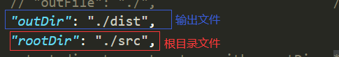
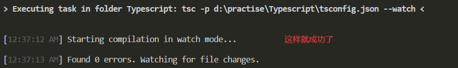
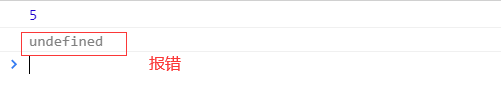
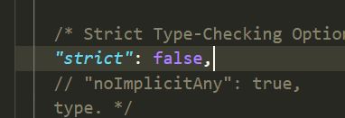
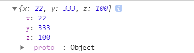
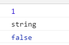
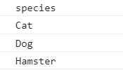
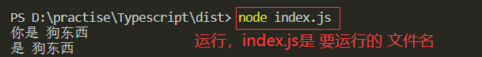
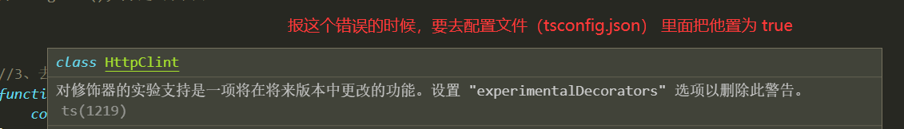
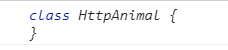

# 一、ts介绍与开发

## 1、介绍

1）TypeScript是由微软开发的一款开源的编程语言。

2）TypeScript是Javascript的超集，遵循最新的ES6/ES5规范。TypeScript扩展了Javascript的语法。

3）TypeScript更像后端Java、C#这样的面向对象的语言，可以让js开发大型项目。

4）谷歌也在大力支持TypeScript的推广，谷歌的angular2.x+就是基于TS语法。

5）TypeScript 设计目标是开发大型应用，它可以```编译成纯 JavaScript```，编译出来的 JavaScript 可以运行在任何浏览器上。

6）TypeScript 是 JavaScript 的超集，扩展了 JavaScript 的语法，因此现有的 JavaScript 代码可与 TypeScript 一起工作无需任何修改，TypeScript 通过类型注解提供编译时的静态类型检查。

7）TypeScript 可处理已有的 JavaScript 代码，并只对其中的 TypeScript 代码进行编译。

## 2、安装

注：```在全局安装```

```
cnpm  i  typescript -g
```

## 3、运行

```
// ts基本数据类型
let str:string = "你好！";
```

运行上面的代码：

```tsc 文件名.ts```（他会自动生成一个相同文件名的js文件）

注：也可以指定文件编译到那块去

```
tsc ./src/index.ts --outFile ./dist/index.js
```

上面这个表示在与src同级的地方创建一个dist文件，并把编译出来的文件命名为index.js。

## 4、实时编译

1）在文件夹下运行（可以在同级的地方，也可以在上一级），但是要删除之前的编译文件

```
tsc --init
```

注：它会出现一个tsconfig.json文件，但是 我们要对他进行修；（这样的话，就会多一个dist文件夹）


2)运行配置文件，让它进行监听(在vsc中点击终端——>运行任务——>tsc:监听)；也可以用指令监听（具体的命令，自己查文档）

这样就可以实时监听文件了。

# 二、类型的介绍
## 1、字符串
	TypeScript像其它语言里一样，使用`string`表示文本数据类型。 和JavaScript一样，可以使用双引号（"）或单引号（'）表示字符串。
```java
let str:string = "你好!!!";
str = "你好！世界。";
```
    也使用```模版字符串```，定义多行文本和内嵌表达式。 这种字符串是被反引号包围  ` ，并且以${ expr }这种形式嵌入表达式。
~~~java
let num:number = 9;
let str = `我的年龄${num}`;
console.log(str);
~~~
```注：如果要查看结果的话，要把编译出来的那个js文件引入html中去。```
## 2、boolean 类型（true   false）
	最基本的数据类型就是简单的`true/false`值，在JavaScript和TypeScript里叫做```boolean```
~~~java
let bool:boolean = true;
~~~
## 3、数字类型
和JavaScript一样，TypeScript里的所有数字都是浮点数。 这些浮点数的类型是`number`。
~~~java
let num:number = 9;
~~~
数字类型和JavaScript一样，TypeScript里的所有数字都是浮点数。 这些浮点数的类型是`number`。
~~~java
let num:number = 9;
~~~
## 4、数组
 TypeScript像JavaScript一样可以操作数组元素。 有两种方式可以定义数组。 
 第一种，可以在元素类型后面接上 `[]`，表示由此类型元素组成的一个数组：
```javascript
let num:number[] = [1,2,4,5];//当然这个里面也可以写字符串，但是  如果你写字符串的话，那个number就要换成string
console.log(num);
```
 第二种方式是使用数组泛型，Array<元素类型>：
```javascript
let arr:Array<number> = [1,2,3,4];
console.log(arr);
```
## 5、元组
元组类型允许表示一个已知元素数量和类型的数组，各元素的类型不必相同。 比如，你可以定义一对值分别为 ```string```和`number`类型的元组。
```javascript
// 声明一个元组类型 x
let x: [string, number]
// 初始化 x
x = ['hello', 10] // OK
// 无效的初始值(这个会报错)
x = [10, 'hello'] // Error
```
当访问一个已知索引的元素，会得到正确的类型：
```javascript
// 声明一个元组类型 x
let x: [string, number]
// 初始化 x
x = ['hello', 10] // OK
console.log(x[0].substr(1));//ello
/* substr是方法，他只能取到字符串 */
```
当访问一个越界的元素，会出现错误,既是根据下标去取一个大于应有长度的时候，他就会报错。
## 6、枚举
注：可以在周几的时候用、请求成功失败等地方可以使用。
1）enum（枚举）类型是对JavaScript标准数据类型的一个补充。 使用枚举类型可以为一组数值赋予友好的名字。（既可以为一组数据友好的赋值名字）
```javascript
enum Color{//枚举里面一般都是大写，或者首字母大写
    RED=3,WHITE,BLUE
}
//下面表示c是枚举类型
let c:Color = Color.WHITE;
console.log(c);//这个打印出来是下标
/*表示枚举是从下标为零开始的（当然也可以指定下标，既就像上面的那样，那么BLUE 的下标就是 5了）
  也可以全部手动赋值，那这样的话，下标就没有意义了
*/
```
2）枚举类型提供的一个便利是你可以由枚举的值得到它的名字。 例如，我们知道数值为2，但是不确定它映射到Color里的哪个名字，我们可以查找相应的名字。
`既代表根据下标找到对应的元素`
```javascript
enum Color{//枚举里面一般都是大写，或者首字母大写
    RED=3,WHITE,BLUE
}
//下面表示c是枚举类型
let c:Color = Color.WHITE;
console.log(c);//这个打印出来是下标 4

let title:string = Color[c];
console.log(title); //WHITE
```
## 7、any
1）在编程阶段还不清楚类型的变量指定一个类型。 这些值可能来自于动态的内容，比如来自用户输入或第三方代码库。 这种情况下，我们不希望类型检查器对这些值进行检查而是直接让它们通过编译阶段的检查。
```javascript
let notSure:any = 4
notSure = "maybe a string instead" // 赋值了一个字符串
notSure = false // 赋值了一个布尔值
console.log(notSure);//false
```
2）在对现有代码进行改写的时候，`any` 类型是十分有用的，它允许你在编译时可选择地`包含或移除`类型检查。
```javascript
let notSure:any = 4
notSure.toString();//任意类型你赋值的是数字，但是调用的时候，你可以用字符串的方法
```
3）当你只知道一部分数据的类型时，`any` 类型也是有用的。 比如，你有一个数组，它包含了不同的类型的数据（既一个数组里面有数字和字符串）

```javascript
let list: any[] = [1, true, "free"];
//这样写它不会报错，当你知道它里面有什么类型的时候，南无这块的这个数组，你就可以用元组去定义
```
## 8、void
某种程度上来说，`void`类型像是与`any`类型相反，它表示没有任何类型。 当一个函数没有返回值时，你通常会见到其返回值类型是 `void`（既表示他是没有返回值的）
```javascript
function echo(): void {
    console.log('啊啊啊啊啊啊');//啊啊啊啊啊啊
}
//下面的是调用上面的函数
echo();


function echo(): void {
    return "啊啊啊啊啊啊啊啊";//这样他会报错，但是你把void改成string，他就可以了。
}
echo();
```
`注：当一个函数没有任何返回值的时候，我们就可以把这个函数用  :void 来进行描述，用它来进行描述的时候，代表它 没有任何返回值。（void一般都用在函数上）`
# 三、类型推断
如果没有明确的指定类型，那么 TypeScript 会依照类型推论（Type Inference）的规则推断出一个类型。
## 1、什么是类型推断
当代码没有指定类型的时候，在编译的时候会出现报错。
```javascript
let str = "啊啊啊啊啊";//内部会根据等号右边的自己进行判断，推断出为string类型的
str = 9;//在这块你后面给他赋值为数字的时候,就会报Type '9' is not assignable to type 'string'.
```
TypeScript 会在没有明确的指定类型的时候推测出一个类型，这就是类型推论。 如果定义的时候没有赋值，不管之后有没有赋值，都会被推断成 any 类型而完全不被类型检查：
```javascript
let string;
string = 7;
string = "你好";
console.log(string);// 你好
//当上面 只定义不赋值，你下面可以任意赋值
```
## 2、联合类型
联合类型（Union Types）表示取值可以为多种类型中的一种。
```javascript
let str:string | number | Array<number>;
//这块表示str既可以支持字符串也可以支持数字,也可以事数组，但是这块表示数组里面要是数字
str = "你好！世界";
console.log(str);
```
`注：联合类型用 | 分隔。`
## 3、访问联合类型的属性或方法
```javascript
// 下面表示传进函数的类型，并且确定一个返回值的类型
function means(str:string) : number{
    return str.length
}

console.log(means("hello"));// 5
```
当 TypeScript 不确定一个联合类型的变量到底是哪个类型的时候，我们只能访问此联合类型的所有类型里共有的属性或方法。
```javascript
// 下面表示传进函数的类型，并且确定一个返回值的类型
 //下面这块也可以事联合类型，让其可以传字符串和数字(但是返回值智能放，两个同时支持的方法)
function means(str:string | number) : string{
    return str.toString();//这块事把传进来的 都改成字符串
}

console.log(means("hello"));// hello
```
访问了number和string的公共属性toString,是没有任何问题的！
## 4、联合类型赋值的类型推断
联合类型的变量在被赋值的时候，会根据类型推论的规则推断出一个类型。
```javascript
let str : string | number;
str = "hello";
console.log(str.length);//5
str = 9;
console.log(str.length);
//这块会报错，因为上面赋值的的是数字，就会推断成数字类型，数字类型 没有长度
```

## 5、Null 和 Undefined
`null 是一个只有一个值的特殊类型。表示一个空对象引用。用 typeof 检测 null 返回是  object。 typeof 一个没有值的变量会返回 undefined`。
null 和 Undefined 是其他任何类型（包括 void）的子类型，可以赋值给其它类型，如数字类型，此时，赋值后的类型会变成 null 或 undefined。
`注：关闭严格模式`：
在tsconfig.json里面进行关闭（将"strict": true, 改为false）

```javascript
/* 
    null和undefined是任何类型的子类型，就代表着在非严格模式下，就可以给任何类型赋值操作
    注：严格模式默认是开启的，需要自己去
    tsconfig.json里面进行关闭（将"strict": true, 改为false）。
*/
let x : number = 1;
x = undefined;//这块会报错(但是关闭严格模式后，他就不会报错了)
```
`注：在严格模式中，可以使用联合模式，那样他也就 不会报错。`


## 6、Never类型
never类型表示的是那些永不存在的值的类型。 例如， never类型是那些总是会抛出异常或根本就不会有返回值的函数表达式或箭头函数表达式的返回值类型； 变量也可能是 never类型，当它们被永不为真的类型保护所约束时。

`never类型是任何类型的子类型，代表从不会出现的值`，也可以赋值给任何类型；然而，没有类型是never的子类型或可以赋值给never类型（除了never本身之外）。 即使 any也不可以赋值给never。
下面是一些返回never类型的函数：
```javascript
/**
 * never 永远不
 * never类型表示的是 那些永不存在的值的类型
 * 一般就是说函数内部抛出异常 or 函数内部有死循环，一直返回不到结果的时候，无休止的执行内部逻辑
 */

// 返回never的函数必须存在无法达到的终点
function error(message: string): never {//永远 没有结果的值
    throw new Error(message);
}
// 推断的返回值类型为never
function fail() {
    return error("Something failed");
}
// 返回never的函数必须存在无法达到的终点
function infiniteLoop(): never {
    while (true) {
        
    }
}
```
## 7、Symbol（他是基本数据类型）
&nbsp;&nbsp;&nbsp;&nbsp;&nbsp;&nbsp;&nbsp;自ECMAScript 2015起（既就是ES6），symbol成为了一种新的原生类型，就像number和string一样。 symbol类型的值是通过Symbol构造函数创建的。
```javascript
//要使用Symbol，要去配置文件中，把es5改成es6，这样 就不会报错了
let syml = Symbol();
let sym2 = Symbol();

console.log(syml === sym2);//false   
//在浏览器中返回false，说明这两个对象是不同的，因为Symbol是独一无二的，即使 你传相同的参数


//使用
//Symbol可以用来作为对象的键  来使用
const sym = Symbol();//他是变量(只能用const，不能用let)
let obj = {
    [sym]:"哈哈",//这是一个键值对
    "name":"用户名字：小明"
}
console.log(obj[sym]);//哈哈
console.log(JSON.stringify(obj));//{"name":"用户名字：小明"}  只能拿到它

//通过上面的打印，发现Symbol当作对象的key（键）的时候，是不能被JSON.stringify() 和 for...in...进行遍历的
//使用一：利用这个特点  更好的去设计对象，使   对内操作和对外选择输出 变得更加优雅。

console.log(Object.getOwnPropertyNames(obj));//["name"]  获取不到

console.log(Object.getOwnPropertySymbols(obj));//这个 可以拿到这个对象

//使用es6的新增反射api
console.log(Reflect.ownKeys(obj)); //(2) ["name", Symbol()]


// 使用二：使用Symbol来替代常量来命名（Symbol是独一无二的）
const RED = Symbol();
const GREEN = Symbol();
const BLUE = Symbol();


let a:any;
a = RED;//
switch(a){
    case RED: //在这匹配a是不是红色，是红色在执行后续的 业务逻辑
        break;
}

//Symbols也可以与计算出的属性名声明相结合来声明对象的属性和类成员。
const getClassNameSymbol = Symbol()

class C {
    // 使用Symbol当成类的成员方法
    [getClassNameSymbol](){
        return "C"
    }
}

let c = new C()
let className = c[getClassNameSymbol]() 
console.log(className)   //"C"
```
注：下面是以此打印的截图：

# 四、函数
## 1、函数类型
### 1）函数声明的方式
```javascript
function sum(x:number,y:number):number{//最后这个number是返回的类型
    return x + y;
}
console.log(sum(2,1));//3
```
注：一个函数有输入和输出，要在 TypeScript 中对其进行约束，需要把输入和输出都考虑到，其中函数声明的类型定义较简单；`输入多余的（或者少于要求的）参数，是不被允许的`。
### 2）函数表达式的方式
```javascript
//下面这种定义方式只对等号右边进行了约束，然后根据等号右边是个函数然后内部经过自动推断，所以编译通过
let num = function(x:number,y:number):number{//这块应该要给num加上类型，没有报错是因为类型推断   
    return x + y;
} 
console.log(num(1,1));//2


// 下面是严谨的写法（平常使用它），调用方法同上
//在ts中箭头函数代表  我要返回的是什么数据类型
let digit:(x:number,y:number) => number = function(x:number,y:number):number{
    return x * y;
}
```
注：在 TypeScript 的类型定义中，`=>` 用来表示函数的定义，左边是输入类型，需要用括号括起来，右边是输出类型。
## 2、用接口定义函数的形状
注：用接口的方式来定义一个函数需要符合的形状。
```javascript
interface Animal{//interface它就是接口，接口名称  一般大写
    //定义了一个函数的基本形状  带一个字符串类型的参数，并且返回值是字符串类型
    (food:string):string
}

let dog:Animal; //定义了一个dog变量，然后是接口Animal类型的
dog = function(food:string):string{//这块是赋值操作,并且定义了类型
    return food;
}
//这里需要传递一个参数
console.log(dog("狗粮"));//狗粮
```
## 3、可选参数
`注：用 ?表示可选的参数`
```javascript
// 我们通过 ? 的方式去定义可选参数，可以定义 也可以不定义
function buildName(firstName: string, lastName?: string) {//注：这个可选的  一定要在后面
    if (lastName) {
        return firstName + ' ' + lastName;//这块是两个拼接
    } else {
        return firstName;
    }
}
let tomcat = buildName('Tom', 'Cat');
console.log(tomcat);//Tom   Cat
let tom = buildName('Tom');
console.log(tom);//Tom
```
`注：可选参数必须接在必需参数后面。换句话说，可选参数后面不允许再出现必需参数了`
## 4、参数默认值
在 ES6 中，我们允许给函数的参数添加默认值，TypeScript 会将添加了默认值的参数识别为可选参数。
```javascript
//参数默认值，可以放到前面，可以放到任何位置，但是必须要传一个，如果实在不想传，就用undefined占位
function text(onetext:string = "老虎",twotext:string){
    // 这块给判断  表示怎末拼接
    if(twotext){//这块表示有twotext的值的时候，走这里，没有的时候  走下面
        return onetext + " " + twotext;
    }else{
        return onetext;
    }
}
console.log(text("猫","狗"));//这里加了参数，他会去把 上面的老虎覆盖掉
console.log(text(undefined,"狐狸"));//第一个也可以  不传任何参数，那么它就会用默认值，但是 第一个必须传
```

## 5、剩余参数
ES6 中，可以使用 `...rest` 的方式获取函数中的剩余参数（rest 参数）：
```javascript
//...是剩余操作符，意思就是把1,2,3,4,5,6赋值给item，item就是一个任意类型的数组了
function insert(array:any[],...item:any[]){
    item.forEach(value =>{//遍历每个元素
        array.push(value);//拿到每一个值，插入到array里
    })
}
//注：any[] 指的是任意类型的数组
let array:any[] = [];//定义
insert(array,1,2,3,4,5,6);//调用上面的方法
console.log(array);//[1, 2, 3, 4, 5, 6]
```
注：看下面这个案例：
```javascript
function push(array: any[], ...items: any[]) {
	items.forEach(function(item) {
		array.push(item)
	})
}

let a:any[] = []
push(a, 1, 2, 3); //a=[1,2,3]
```

## 6、重载
重载允许一个函数接受不同数量或类型的参数时，作出不同的处理。
比如，我们需要实现一个函数 `reverse`，输入数字 `123` 的时候，输出反转的数字 `321`，输入字符串 `hello` 的时候，输出反转的字符串 `olleh`。
`注：实现数字或者字符串的反转。`
```javascript
//在这定义返回值(可以加快反应，不用在进入逻辑后在判断，可以提高性能)
function reverse(x:number):number;//这块代表我们传入数字，返回的也是数字
function reverse(x:string):string;//这块代表我们传入字符串，返回的也是字符串

function reverse(x: number | string): number | string {//这块表示传入数字或者字符串，返回数字或者字符串
	//这个是方法的实现（下面这个有一个缺点，无法确定返回值 类型，解决方法如上）。
    if (typeof x === 'number') {
        return Number(x.toString().split('').reverse().join(''));
    } else if (typeof x === 'string') {
        return x.split('').reverse().join('');//这块是返回值
    }
    return x;
}
console.log(reverse(123));//321
console.log(reverse("hello"));//olleh
```
# 五、接口
## 1、接口定义
`注：把接口可以理解成，定义一套规范的标准。`
在 TypeScript 中，我们使用接口（==Interfaces==）来定义对象的类型。

在面向对象语言中，接口（Interfaces）是一个很重要的概念，它是对行为的抽象，而具体如何行动需要由类（classes）去实现（implement）。 TypeScript 中的接口是一个非常灵活的概念，除了可用于对类的一部分行为进行抽象以外，也常用于对「对象的形状（Shape）」进行描述。

案例：
```javascript
// 接口   对 对象的形状进行约束和规范

//接口里面的字段，需要p去规范化，也是以后在只要是人这个类别的，你就需要去遵守我这个规范
interface Person{
    userName:string;
    age:number;
    sayHello():void;//sayHello是个函数，后面跟void，则不需要返回值（也就是return）
}

// 下面这个是对象（也就是你说这个对象是人，那么你里面必须要有名字 和 年龄）
let p:Person={//这块希望p是Person类型的（也就是这个接口类型的）
    //在这个里面把这个Person的形状写出来
    userName:"里斯",//这里用逗号，对象里面都是用逗号 隔开的
    age:22,
    sayHello:():void => {
	
	}
};

console.log(p);//{userName: "里斯", age: 22}
```
`注：赋值的时候，变量的形状必须和接口的形状保持一致(多属性也是不允许的)。`
## 2、可选属性
`注：可选属性是可以不存在的，但是还是不能够添加 未定义的属性。`
```javascript
interface Person{
    userName:string;
    age?:number;//这个就是可选属性
}

let p:Person = {
    userName:"张三"
}
console.log(p);//{userName: "张三"}
```
## 3、任意属性（索引签名）
```javascript
interface Person{
    userName:string;
    age?:number;
    // 下面写是 任意类型是字符串
    [prop:string]:any;
    /*  这个就是任意属性（注：any是任意类型），同时prop的类型只能是数字或者字符串，这块写any，
    是因为你要保证上面两个的类型，是他的子类型*/
}

let p:Person = {
    userName:"张三",//userName、age等也可以定义成字符串，也不会报错，因为对象的key 不管你，怎末写都是字符串
    age:89,//这个都可以不写
    prop:88//任意属性，这里可以写数字、字符串等
}

console.log(p);//{userName: "张三", age: 89, prop: 88}
```
## 4、只读类型
`注：readonly代表只读类型，就是定义后，后期不能在对他进行 修改。`
```javascript
interface Person{
    name:string;
    age:number;
}

let p:Person = {
    name:"张三",
    age:18
}
p.name = "张私";//在这块对p.name进行了改变
console.log(p);//{name: "张私", age: 18}
```
接下来，我们给 ==name==加一个属性，那么你再去改变值的时候，它就会报错。
```javascript
interface Person{
    readonly name:string;//这块可以写成可选属性
    age:number;
}

let p:Person = {
    name:"张三",
    age:18
}
// p.name = "张私";//上面加了readonly属性，它就不能在下面这进行 改变了
console.log(p);//{name: "张三", age: 18}
```

`注: 只读的约束存在于第一次给对象赋值的时候，而不是第一次给只读属性赋值的时候。`
# 六、`类`
传统方法中，JavaScript 通过构造函数实现类的概念，通过原型链实现继承。而在 ES6 中，有了 `class`。

TypeScript 除了实现了所有 ES6 中的类的功能以外，还添加了一些新的用法。

## 1、类的概念
虽然 JavaScript 中有类的概念，但是可能大多数 JavaScript 程序员并不是非常熟悉类，这里对类相关的概念做一个简单的介绍。

- 类(Class)：定义了一件事物的抽象特点，包含它的属性和方法
- 对象（Object）：类的实例，通过 `new` 生成
- 面向对象（OOP）的三大特性：封装、继承、多态
- 封装（Encapsulation）：将对数据的操作细节隐藏起来，只暴露对外的接口。外界调用端不需要（也不可能）知道细节，就能通过对外提供的接口来访问该对象，同时也保证了外界无法任意更改对象内部的数据
- 继承（Inheritance）：子类继承父类，子类除了拥有父类的所有特性外，还有一些更具体的特性
- 多态（Polymorphism）：由继承而产生了相关的不同的类，对同一个方法可以有不同的响应。比如 `Cat（猫）` 和 `Dog（狗）` 都继承自 `Animal（动物）`，但是分别实现了自己的 `eat（吃）` 方法。此时针对某一个实例，我们无需了解它是 `Cat` 还是 `Dog`，就可以直接调用 `eat` 方法，程序会自动判断出来应该如何执行 `eat（吃）`，都是同一种，但是有不同的表现形式
- 存取器（getter & setter）：用以改变属性的读取和赋值行为
- 修饰符（Modifiers）：修饰符是一些关键字，用于限定成员或类型的性质。比如 `public` 表示公有属性或方法
- 抽象类（Abstract Class）：抽象类是供其他类继承的基类，抽象类不允许被实例化。抽象类中的抽象方法必须在子类中被实现
- 接口（Interfaces）：不同类之间公有的属性或方法，可以抽象成一个接口。接口可以被类实现（implements）。一个类只能继承自另一个类，但是可以实现多个接口。
 ## 2、回顾ES6中类的用法
 ### 1)属性和方法
```javascript
//Es6中定义类  当我们实例化对象的时候，它默认就会走constructor构造器进行对象的实例化操作。
class Animal{
    // name是属性
    name:string = "";
    constructor(){//加了它，下面打印的是 🐱（这个是类的方法）
        this.name = "🐱";
    }
    // 类里面可以有成员属性，也可以有成员方法
    sayName():string{
        return this.name
    }
}

// 实例化一个对象出来
let cat = new Animal();//这里可以传参
console.log(cat.sayName());//这个打印出来  是一个空
```

```javascript
class Animal{
    // name是属性
    name:string = "";
    constructor(name:string){//加了它，下面打印的是 🐱（这个是类的方法）
        this.name = name;
    }
    // 类里面可以有成员属性，也可以有成员方法
    sayName():string{
        return this.name
    }
}

// 实例化一个对象出来
let cat = new Animal("🐱");//这里可以传参
console.log(cat.sayName());
```
```javascript
class Animal{
    constructor(public name:string){//在这加public，就代表重构了一个属性，就不用先定义name了
        this.name = name;
    }
    // 类里面可以有成员属性，也可以有成员方法
    sayName():string{
        return this.name
    }
}

// 实例化一个对象出来
let cat = new Animal("🐱");//这里可以传参
console.log(cat.sayName());//🐱
```

### 2)类的继承
使用 `extends` 关键字实现继承，子类中使用 `super` 关键字来调用父类的构造函数和方法。
```javascript
class Animal{
    name:string  = "小王";
    // 方法
    sayName():string{
        return this.name;//这里返回的这个this，代表当前的实例
    }
}
//加个extends就继承了 上面的动物类
class Cat extends  Animal{
    
}
let cat = new Cat();
console.log(cat.name);//小王  注：这样就可以访问父的 方法
```

```javascript
//就近原则（子有了，就不用夫的了）
class Animal{
    name:string  = "小王";
    // 方法
    sayName():string{
        return this.name;//这里返回的这个this，代表当前的实例
    }
}
//加个extends就继承了 上面的动物类
class Cat extends  Animal{
    name:string = "猫";
}
let cat = new Cat();
console.log(cat.name);//猫
```

 

```javascript
class Animal{
    name:string  = "小王";
    // 方法
    sayName():string{
        return this.name;//这里返回的这个this，代表当前的实例
    }
}
//加个extends就继承了 上面的动物类
class Cat extends  Animal{
    name:string = "猫";
    sayName():string{//子类的方法有了，就用自己的
        return this.name+"^_^";
    }
}
let cat = new Cat();
console.log(cat.sayName());//猫^_^ 注：这块是调用方法，也就是  进行逻辑处理
```
也可以在子类里面自己额外的添加加属性和方法：
```javascript
class Animal{
    name:string  = "小王";
    // 方法
    sayName():string{
        return this.name;//这里返回的这个this，代表当前的实例
    }
}
//加个extends就继承了 上面的动物类
class Cat extends  Animal{
    name:string = "猫";
    sayName():string{//子类的方法有了，就用自己的
        return this.name+"^_^";
    }
    sayHello():string{
        return "你好！！！"
    }
}
let cat = new Cat();
console.log(cat.sayName());//猫^_^ 
console.log(cat.sayHello());//你好
```
子类可以通过`super`关键字调用父类的方法或者属性
```javascript
class Animal{
    name:string  = "小王";
    // 方法
    sayName():string{
        return this.name;//这里返回的这个this，代表当前的实例
    }
}
//加个extends就继承了 上面的动物类
class Cat extends  Animal{
    name:string = "猫";
    sayName():string{//子类的方法有了，就用自己的
        return this.name + "^_^" + super.sayName();//super  是一个固定的，它是指父类的 方法（因为 这块的子类定义了属性，所以  它用的 就是子类的属性）
    }
    sayHello():string{
        return "你好！！！"
    }
}
let cat = new Cat();
console.log(cat.sayName());//猫^_^猫
console.log(cat.sayHello());//你好
```
### 3）存取器
使用 getter 和 setter 可以改变属性的赋值和读取行为：
```javascript
//类似与vue的计算属性
class Animal{
    constructor(public name:string){
        // 成员属性name
        this.name = name;
    }
    // 在外面 要用的时候，就使用这个get
    get sayName(){
        return this.name;
    }
    // 改变内部的属性 用set
    set sayName(value:string){
        this.name = value;
    }
}

let animal = new Animal("小明");//这块的参数，传上去
console.log(animal.sayName);//小明
animal.sayName = "小宝";//这个是修改值
console.log(animal.sayName);//小宝
```
### 4）静态方法
使用 `static` 修饰符修饰的方法称为静态方法，它们不需要实例化，而是直接通过类来调用：
```javascript
class Animal{
    static animal:string = "动物";
} 

let dog = new Animal();

console.log(Animal.animal);//静态属性，要用类（Animal）去拿（注：不能用实例拿）
```
`注：静态属性和静态方法，只能通过类去调用。`
```javascript
class Animal{
    static animal:string = "动物";
    static isAnimal(animalTwo:any):boolean{/*在这你需要传一个任意类型的变量，
    最后返回一个布尔值*/
        // 用instanceof 去判断是不是某个东西的实例
        return animalTwo instanceof Animal;//这个是静态方法
    }
} 

let dog = new Animal();
console.log(Animal.isAnimal(dog));//true
console.log(Animal.isAnimal("哈哈哈"));//false   因为它不是Animal的实例
```
### 5） `TypeScript中类的用法`
#### ①public private 和 protected

TypeScript 可以使用三种访问修饰符（Access Modifiers），分别是 `public`、`private` 和 `protected`。

- `public` 修饰的属性或方法是公有的，可以在任何地方被访问到，默认所有的属性和方法都是 `public`的
- `private` 修饰的属性或方法是私有的，不能在声明它的类的外部访问
- `protected` 修饰的属性或方法是受保护的，它和 `private` 类似，区别是它在子类中也是允许被访问的。

`默认不写这个修饰符，就是用的public修饰的,定义了public类的内外部，都可以正常使用。`
```javascript
//默认的话如果不带修饰符修饰的话，在类内部和外部都是可以访问到类的成员属性与成员方法。
class Animal{
    //属性
    public name:string = "动物";//默认不写这个修饰符，就是用的public修饰的
    // 方法
    public sayName():string{
        return this.name;
    }
}
//创建动物这个类的实例
let animal = new Animal();
console.log(animal.name);//动物
```
`通过private修饰的成员属性和成员方法，只能在类内部可以访问,类的外部与子类都是不能访问的。`

所以上面这个 会报错。
`通过protected修饰，在外部是拿不到的（注：这样就和private一样了，但是在继承中，可以看到他俩的区别了）
通过protected修饰的成员属性和成员方法，类内部和子类是可以访问，类的外部是不能访问的。
`
```javascript
class Animal{
    //属性
    name:string = "动物";
    // 方法
    protected sayName():string{
        return this.name;
    }
}
// 下面这个是继承
class Cat extends Animal{
    sayHello(){
        return super.sayName();
    }
}
//创建动物这个类的实例
let animal = new Animal();
console.log(animal.name);//动物
```
#### ②readonly只读属性
只读属性关键字，只允许出现在属性声明或索引签名中（索引签名是接口里面的）。
```javascript
class Animal{
    readonly name:string = "cat"
    public sayName(){
        console.log("sayName")
    }
}
let animal = new Animal()
animal.name = 'dog' //报错了 name只能读取不能进行修改
console.log(animal.name) 
```
## 3、抽象类
`abstract` 用于定义抽象类和其中的抽象方法。
`注：抽象类 也是可以用来定义一些规范的，比如有些类 就提供了这个状态，供别的类 去根据这个状态去相应的改造。`
什么是抽象类？
首先，抽象类是不允许被实例化的：
```javascript
/*一旦一个类里面通过abstract关键字声明了，那么这个类必须通过abstract进行标明。
 * 抽象类是不能被new  进行实例化的
 * 一旦抽象类里面有抽象方法，那么子类在继承抽象类的时候，必须要实现抽象类里面抽象方法。
*/
abstract class Animal{
    name:string = "";
    constructor(name:string){
        this.name = name;
    }
    // Animal的抽象方法
    abstract sayHello():void
}
// 写一个类 去继承这个抽象类，然后再去实现
class Cat extends Animal{
    sayHello():void{
    	//这块不能用super，super只能拿到成员方法
        console.log("这是cat的sayHello的方法" + this.name);//这是cat的sayHello的方法猫
    }
}
//在这在进行实例化
new Cat("猫").sayHello();
```
# 七、类和接口
之前学习过接口（Interfaces）可以用于对「对象的形状（Shape）」进行描述。
这一章主要介绍接口的另一个用途，对类的一部分行为进行抽象。
## 1、类实现接口
`注：一个类  可以通过 implements 去实现n个接口，但是一个类只能通过extends继承一个类。`
实现（implements）是面向对象中的一个重要概念。一般来讲，一个类只能继承自另一个类，有时候不同类之间可以有一些共有的特性，这时候就可以把特性提取成接口（interfaces），用 `implements` 关键字来实现。这个特性大大提高了面向对象的灵活性。

举例来说，门是一个类，防盗门是门的子类。如果防盗门有一个报警器的功能，我们可以简单的给防盗门添加一个报警方法。这时候如果有另一个类，车，也有报警器的功能，就可以考虑把报警器提取出来，作为一个接口，防盗门和车都去实现它。
```javascript
/*思想：
防盗门继承门  门的话有报警的功能，还有很多的一些东西都会有报警的功能，所以呢我们可以把报警的功能单独进行抽离，封装成接口。
*/
//2、先定义出来
class Door{}
// 3、把公有的 封装成接口
interface Alarm{//这是一个类
    // 实现一个方法，这个方法没有返回值，方法名就叫alert
    alert():void
}
//1、希望下面这个SecurityDoor 报警功能
class SecurityDoor extends Door implements Alarm{
    // 把这个方法，在这定义出来
    alert():void{
        console.log("SecurityDoor的alert方法");
    }
}
// new 一个这个类的方法
let securityDoor = new SecurityDoor();
securityDoor.alert();
```

一个类可以实现多个接口：
```javascript
//一个类  可以通过 implements 去实现n个接口
interface Alarm {
    alert():void
}
  
interface Light {
    lightOn():void
    lightOff():void
}
//这样  就表示 一个车，可以通过implements去实现多个接口
class Car implements Alarm,Light{
    alert():void{
        console.log("Car（车）的alert。。。");
    }
    lightOn():void{
        console.log("Car（车）的lightOn。。。")
    }
    lightOff():void{
        console.log("Car（车）的lightOff。。。")
    }
}
let car = new Car();
car.alert();
car.lightOn();
car.lightOff();
```

## 2、接口继承接口
接口与接口之间可以是继承关系。
```javascript
//接口可以通过 extends 去继承接口
// A接口 extends B接口，那么class C implements A的话，需要将A、B接口的抽象方法都实现一下
interface Alarm{
    alert():void
}
interface Dog extends Alarm{ //Dog去继承Alarm
    //然后Dog有一个each的方法
    each():void
}
class Demo implements Dog{//Demo去实现Dog接口
    //在这吧 each 覆盖掉
    each():void{}
    alert():void{}
}
```
## 3、接口继承类
```javascript

class Num {
    // 要先赋值  初始化
    x:number | undefined = 1  //这样写代表 可以是数字，也可以 是未定义
    y:number = 2
}
//他是 一个接口，可以约束 对象的类  形状
interface NumAll extends Num {
    z:number
}

let p:NumAll = {
    x:22,
    y:333,
    z : 100
}

console.log(p);
```

## 4、混合类型
```javascript
//下面 是一个接口（接口 也可以约束 函数的样子）
interface Search{
    // 下面是两个参数，需要传两个 字符串，最后返回一个布尔值
    (source:string,subString:string):boolean
}
//可以限制 函数的形状
let fn:Search   //这里写函数的话，必须是Search的一个形态
fn = function(source:string,subString:string):boolean{
    return true
}
console.log(fn);
```
# 八、`泛型`
`泛型（Generics）是指在定义函数、接口或类的时候，不预先指定具体的类型，而在使用的时候再指定类型的一种特性。`
## 1、简单的例子
首先，我们来实现一个函数 `createArray`，它可以创建一个指定长度的数组，同时将每一项都填充一个默认值。
```javascript
//接受数组的长度，还有传过来的  每一个值
function createArray(length:number,value:any){//数组长度是数字，值是任意类型
    let result = [];
    // 便利
    for(let i=0;i<length;i++){
        result.push(value);
    }
    //在这一定要return 
    return result;
}

console.log(createArray(3,"哈"));//["哈","哈","哈"]
```
`在这把泛型放进函数：`
注：我们在函数名后添加了<T>,其中 `T` 用来指代任意输入的类型，在后面的输入 `value: T` 和输出 `Array` 中即可使用了。接着在调用的时候，可以指定它具体的类型为 `string`。当然，也可以不手动指定，而让类型推论自动推算出来；`也就是  可以指定类型，也可以  不指定类型，让其自己推断出来。`
```javascript
//接受数组的长度，还有传过来的  每一个值
//在函数上使用泛型(这块的 T 代表类型，只不过这个 类型，只有  在下面调用的时候，才知道)
function createArray<T>(length:number,value:T):Array<T>{//数组长度是数字，值是任意类型,得到的值 是字符串
    let result = [];
    // 便利
    for(let i=0;i<length;i++){
        result.push(value);
    }
    //在这一定要return ，这里  不能返回一个明确的类型
    return result;
}
// 只要调用createArray的时候，并且传入具体类型的时候，才知道  返回什么类型
//写法1
console.log(createArray<string>(3,"哈"));//["哈","哈","哈"]
//写法2
console.log(createArray(3,"哈"));
```

## 2、定义多个类型的参数
```javascript
//定义多个类型的参数
function swap<T, U>(tuple: [T, U]): [U, T] {
    return [tuple[1], tuple[0]]
}
console.log(swap([7, '七'])) // ['七', 7]
```
## 3、泛型约束
在函数内部使用泛型变量的时候，由于事先不知道它是哪种类型，所以不能随意的操作它的属性或方法。
```javascript
function abc<T>(arg:T):T{
    /**
     * 在函数内部去使用泛型变量的时候，不要在函数内部去操作 变量的属性（因为 这里是不存在的）
     */
    // 返回传进来的 那个东西，才可以打印，因为  return 是把值 返回给了 外层
    return arg;
}
console.log(abc("哈哈哈啊哈"));
```
1）采用泛型约束，只允许函数调用的时候传入那些包含length属性的变量。
```javascript
/*
*使用了extends约束了泛型T必须要符和Len这个接口。也就是说这个类型T受到约束了，内部必须支持length属性。
*约束数据类型T必须要有length属性
*/
interface Len{
    length:number
}
// 用extends 去继承上面的  方法
function abc<T extends Len>(arg:T):T{
    console.log(arg.length);
    return arg;
}

console.log(abc("hahahahhhahahah"));//这块  不可以传数字类型，因为 他没length属性
```

## 4、泛型接口
1）使用接口的方式来定义一个函数需要符合的形状

```javascript
interface SearchFunc {
    (source: string, subString: string): boolean
}
  
let mySearch: SearchFunc;
mySearch = function(source: string, subString: string) {
    return source.search(subString) !== -1
}
```
2）使用含有泛型的接口来定义函数的形状：

```javascript
interface CreateArrayFunc {
    <T>(length: number, value: T): Array<T>
}
  
let createArray: CreateArrayFunc;
createArray = function<T>(length: number, value: T): Array<T> {
    let result: T[] = []
    for (let i = 0; i < length; i++) {
        result[i] = value
    }
    return result
}

console.log(createArray(3, 'x')); // ['x', 'x', 'x']
```
3）把泛型参数提前到接口名上
```javascript
//在函数上 定义了泛型，南无就可以 把泛型 拿出来
interface CreateArrayFunc<T> {//这是  一个接口
    (length: number, value: T): Array<T>
}
//这是 一个 接口，需要 一个参数
let createArray: CreateArrayFunc<string>;//实现的  时候，在这 必能写 number
createArray = function<T>(length: number, value: T): Array<T> {
    let result: T[] = []
    for (let i = 0; i < length; i++) {
        result[i] = value
    }
    return result
}

console.log(createArray(3, 'x')); // ['x', 'x', 'x']
```
`此时在使用泛型接口的时候，需要定义泛型的类型。`
## 5、泛型类
1）定义 一个类
```javascript
class  Demo{
    username:string
    // 这个事 构造函数
    constructor (){//不写 这个 会报错
        this.username = "小名";
    }
}
```
2）泛型对类的约束
```javascript
class  Demo<T>{
    /** 
     * 在这块  不想让其报错，有两种方法：
     * 1、给string后面 加  | undefined
     * 2、去tsconfig.json 里把它置为  "strictPropertyInitialization":false,
    */ 
    username:T //在这  我使用了 第二种
    // 在这约束 成员的方法
    add(x:T):T{
        return x
    }
}

let demo:Demo<string> = new Demo<string>();//在这  也可以不写这两个<string>，让其自己 进行类型推断
demo.username = "哈哈哈哈哈啊啊啊啊";//上面 给了限制，所以这 只能是字符串；注：上面 也可以限制为 别的类型
demo.add("我成员的方法");
console.log(demo);
```


## 6、泛型的案例
```javascript
//泛型的案例(函数返回接口类型，需要这个函数返回一个对象，对象的形状收到接口的约束)
//T就是代表一个数据类型
interface Result<T>{//interface是一个接口去定义了一个Result，尖括号里面的T是数据类型。
	//写一个数据，T类型的接口
    data:T 
}

//我不知道它具体返回什么类型值的时候我才用泛型进行约束
//希望getData方法返回一个对象，这个对象必须遵从Result接口规范
function getData<T>():Result<T>{/*这是一个方法，getData函数，里面的T是泛型，
*/
	//定义了data是任意类型（定义在里面data要定义成 any）
    let data:any = [1,2,3]
    return {
		data
	}
}
//调用
console.log(getData());//[1,2,3]
```

```javascript
interface Result{
    data:string
}
function getData():Result{
    let data:string = "哈哈哈哈"
    return {
        data
    }
}

console.log(getData());//哈哈哈哈
```


```javascript
//泛型的案例(函数返回接口类型，需要这个函数返回一个对象，对象的形状收到接口的约束)
//T就是代表一种数据类型
interface Result<T>{
    data:T
}

//我不知道它具体返回什么类型值的时候我才用泛型进行约束
//希望getData方法返回一个对象，这个对象必须遵从Result接口规范
function getData<T>(): Promise<Result<T>>{
    let data:any
    return Promise.resolve({data})//{data}这个是返回值，是一个对象
}

```
# 九、迭代器和生成器
`可迭代性`
## 1、for..of 语句
`for..of会遍历可迭代的对象，调用对象上的Symbol.iterator方法。`
```javascript
//for...of可以用来遍历实现Symbole.iterator的类型对象，如string/map/set/array等数据结构
let someArray = [1, "string", false]

for (let entry of someArray) {
  console.log(entry) // 1, "string", false
}
```

注：他不能便利对象。
`对象是不能够被for...of进行迭代的，因为其上面没有实现Symbol.iterator接口`
## 2、for...in...
```javascript
let json:any = {a:1,b:2,c:3};
for(let key in json){
    console.log(key,json[key]);
}
```

## 3、for..of... 与 for..in... 语句
for..of和for..in均可迭代一个列表；但是用于迭代的值却不同，for..in迭代的是对象的键的列表，而for..of则迭代对象的键对应的值。
```javascript
let list = [4, 5, 6]

for (let i in list) { //i获取的是数组的下标
  console.log(i) // "0", "1", "2",
}

for (let i of list) {  //这里获取的是数组里面的每一个值
  console.log(i) // "4", "5", "6"
}
```
## 4、
```javascript
let pets = new Set(["Cat", "Dog", "Hamster"]);

for (let pet in pets) {
  console.log(pet) //这个无结果
}
```

```javascript
let pets = new Set(["Cat", "Dog", "Hamster"]);

for (let pet of pets) {
  console.log(pet) // "Cat", "Dog", "Hamster"
}
```

```javascript
let pets:any = new Set(["Cat", "Dog", "Hamster"]);
// 这块的意思是给set对象，赋一个 key 值
pets["species"] = "mammals"

for (let pet in pets) {
  console.log(pet) // species
}

for (let pet of pets) {
  console.log(pet) // "Cat", "Dog", "Hamster"
}
```

# 十、 命名空间与模块
在代码量较大的情况下，为了避免各种变量命名冲突，可将相似功能的函数、类、接口等放置到命名空间内

同java的包、.net的命名空间一样，ts的命名空间可以将代码包裹起来，只对外暴露需要在外部访问的对象。命名空间内的对象需要通过export暴露。
### 命名空间和模块的区别？
 `命名空间：内部模块，主要用于组织代码，避免命名冲突`

 `模块：ts的外部模块的简称，侧重代码的复用，一个模块可能会有多个命名空间`
```javascript
//下面这样写的 好处是各自维护各自的
namespace A{
    interface Animal{
        name:string
        eat():void
    }
    //这里需要把这个类 暴露出去
    export class Dog implements Animal{
        name:string = "dog"
        eat():void{
            console.log("你是 狗东西")
        }
    }
}

namespace B{
    interface Animal{
        name:string
        eat():void
    }

    export class Dog implements Animal{
        name:string = "dog"
        eat():void{
            console.log("是 狗东西")
        }
    }
}

let aDog = new A.Dog();
// 这块是调用
aDog.eat(); //你是 狗东西


let bDog = new B.Dog();

bDog.eat(); //是 狗东西
```

`注`：把一些内容单独抽离出去封装成一个模块，侧重代码的复用
1）创建一个Animal.ts文件，里面是封装的东西
`注：下面这样写的 好处是各自维护各自的,  这块可以用在代码 比较繁琐的地方，你不能去改别人的，所以你就这样定义模块，自己改变的，永远是自己的。`
```javascript
// 这个就是封装的 模块
//下面这样写的 好处是各自维护各自的
export namespace A{
    interface Animal{
        name:string
        eat():void
    }
    //这里需要把这个类 暴露出去
    export class Dog implements Animal{
        name:string = "dog"
        eat():void{
            console.log("你是 狗东西")
        }
    }
}

export namespace B{
    interface Animal{
        name:string
        eat():void
    }

    export class Dog implements Animal{
        name:string = "dog"
        eat():void{
            console.log("是 狗东西")
        }
    }
}
```
2）在index.ts里面引用（他俩是同级）
```javascript
import {A,B} from "./Animal";//这里不能加文件后缀

let aDog = new A.Dog();
// 这块是调用
aDog.eat(); //你是 狗东西


let bDog = new B.Dog();
bDog.eat(); //是 狗东西
```
注：上面的直接在浏览器运行报错，所以要在node中运行。


# 十一、装饰器
简介：装饰器是一种特殊类型的声明，它能够附加到类、类的函数、类属性、类函数的参数上，以达到修改类的行为。
## 1、类的装饰器
类装饰器是在类声明之前被声明。类装饰器可以应用于类构造函数，可以用来监视、修改或替换类定义。

```javascript
//3、去写装饰器，装饰器  就是 一个函数
function logClass(param:any) {
    console.log(param);
}
//2、创建一个装饰器(logClass 他是装饰器的 名称)
@logClass
//1、定义一个类
class HttpAnimal {

};
```

打印出来的结果如下：

1）没有传入任何的参数，我们称为 普通装饰器
```javascript
//3、去写装饰器，装饰器  就是 一个函数
function logClass(param:any) {
    // console.log(param);//打印出来 是一个构造函数，那么他就是  一个构造函数了
    //是构造函数，就可以找到 原型对象了
    param.prototype.url = "http://www.baidu.com";//在这块 添加一个属性名（url），然后 在添加一个属性值
    param.prototype.showUrl = function(){
        console.log(this.url);
    }
}
//2、创建一个装饰器(logClass 他是装饰器的 名称)
@logClass  
//1、定义一个类
class HttpAnimal {


};
// 4、创建一个实例
let http:any = new HttpAnimal();
//5、调用当前实例
console.log(http.url);
http.showUrl();
```

2）`装饰器工厂` （可以传入参数） 用的地方比较多
```javascript
function logClass(param:any) {
    // 返回一个函数
    return function(target:any){
        target.prototype.url = param
    }
}
@logClass("http://www.baidu.com")
class HttpAnimal {

};
let http:any = new HttpAnimal();
console.log(http.url);//http://www.baidu.com
```
3）不仅可以增加类的属性与方法，还可以修改当前类的构造函数以及当前类的方法

类装饰器重载构造函数的例子：
```javascript
function catClass(target:any){
    // 返回一个匿名的class，继承一个 target 这个类
    return class extends target{
        constructor(){
            super();
            console.log("我是装饰器里面的constructor。。。") //2、再去执行它（因为target是继承父类的，所以 先走他，也就是 先父 后子）
        }
    }
}

@catClass
class HttpAnimal{
    constructor(){
        console.log("我是HttpAnimal的构造函数");  //1、先去执行它
    } 
}
// 创建对象
let http:any = new HttpAnimal();
```


```javascript
//装饰器里面一旦返回class  extends target之后    那么这个类就可以覆盖target类里面的属性和方法了。
function catClass(target:any){
    // 返回一个匿名的class，继承一个 target 这个类
    return class extends target{
        // 可以在这 进行修改（不修改，就不要赋值就好，不写 url:string 他会报错）
        url:string = "我修改后的url"
    }
}

@catClass
class HttpAnimal{
    url:string
    constructor(){
        //在这 进行赋值
        this.url = "HttpAnimal..." 
    } 
}
// 创建对象
let http:any = new HttpAnimal(); 
console.log(http.url); // HttpAnimal...
```

## 2、属性装饰器
属性装饰器表达式会在运行时当做函数被调用，传入下列2个参数：
- 对于静态成员来说是类的构造函数，对于实例成员是类的原型对象
- 成员的名字
```javascript
function logProperty(params:string){
    return function(target:any,attr:any){
        console.log(params,target,attr)
    }
}

class HttpAnimal{
    @logProperty("修改后的属性")
    api:string
}
```

```javascript
function logProperty(params:string){
    return function(target:any,attr:any){
        // console.log(params,target,attr)
        //把原型对象上面的属性变成url...
        target[attr] = "原型对象上面的属性apiUrl......"
    }
}

class HttpClient{
    @logProperty("修改后的属性")
    apiUrl:string 
}

let http:any = new HttpClient()
console.log(http.apiUrl)
```

## 3、方法装饰器
会被应用到方法的属性描述上，可以用来监视，修改或者替换方法定义；方法装饰会在运行时传入下列3个参数:

- 对于静态成员来说是类的构造函数，对于实例成员是类的原型对象
- 成员的名字
- 成员的属性描述符
1）传参数
```javascript
class HttpClient{
    getData(...args:any[]){
        console.log(args);
    }
}
let http = new HttpClient();
//在这 可以，通过剩余操作符 传参
http.getData(1,2,3);   //打印[1, 2, 3]
```
2）类如 传入任何参数，都会返回一个 字符串
①初步解释
```javascript
function logMethods(params:string){
    return function(target:any,methods:string,desc:any){
        console.log(target,methods,desc);
    }
}

class HttpClient{
    //用方法  去替换
    @logMethods("我是方法装饰器")
    getData(...args:any[]){
        console.log(args);
    }
}
let http = new HttpClient();
```

②拿到这个方法，进行使用
```javascript
function logMethod(params:string){
    return function(target:any,method:string,desc:any){
        // console.log(target,methods,desc);
        let oldMethod = desc.value;
        // 去更改 这个方法,下面给方法 重新定义
        desc.value = function(...args:any[]){//任意类型的数组
            args = args.map(item=>{
                return item.toString()
            })
            oldMethod.apply(this,args)//让之前的getData去执行，只是改变了传入的args参数，都改造承了字符串类型的参数

        }
    }
}

class HttpClient{
    //用方法  去替换
    @logMethod("我是方法装饰器")
    getData(...args:any[]){
        console.log(args)
    }
}
let http = new HttpClient()
//在这 可以，通过剩余操作符 传参
http.getData(1,2,3);   //打印["1", "2", "3"]
```
## 4、方法参数装饰器
参数装饰器表达式会在运行时当做函数被调用，可以使用参数装饰器为类的原型增加一些元素数据，传入下列3个参数：
- 对于静态成员来说是类的构造函数，对于实例成员是类的原型对象
- 方法的名字
- 参数在函数参数列表中的索引
```javascript
function logParams(params:string){
    return function(target:any,method:any,index:any){
        console.log(target,method,index)
        target.apiUrl = params
    }
}


class HttpClient{
    getData(@logParams("XXX") params:string){
        console.log(params)
    }
}

let http:any = new HttpClient()
http.getData("hello")
console.log(http.apiUrl)
```

## 5、几种装饰器的执行顺序
类装饰器、属性装饰器、方法装饰器、方法参数装饰器的执行顺序？
```javascript
function logClass1(params:string){
    return function(target:any){
        console.log("类装饰器1执行了..")
    }
}
function logClass2(params:string){
    return function(target:any){
        console.log("类装饰器2执行了..")
    }
}

function logProps(params:string){
    return function(target:any,attr:any){
        console.log("属性装饰器执行了...")
    }
}

function logMethod(params:string){
    return function(target:any,method:any,desc:any){
        console.log("方法装饰器执行了...")
    }
}

function logParams1(params:string){
    return function(target:any,method:any,index:any){
        console.log("方法参数装饰器1执行了...")
    }
}
function logParams2(params:string){
    return function(target:any,method:any,index:any){
        console.log("方法参数装饰器2执行了...")
    }
}


//类的参数 装饰器
@logClass1("哈哈")
@logClass2("呵呵")
class HttpClient{
    //属性 装饰器
    @logProps("啊啊")
    url:string

    @logMethod("哦哦")
    //这是 一个方法
    getData(){return "getData"}
    //方法的 参数装饰器
    setData(@logParams1("xx") a:any,@logParams2("XX") b:any){

    }
}
```

`依次执行属性装饰器、方法装饰器、方法参数装饰器、类装饰器执行顺序是从后往前的顺序执行。`


注：全部代码[地址](https://wws.lanzous.com/i5sBYgkllra)：https://wws.lanzous.com/i5sBYgkllra